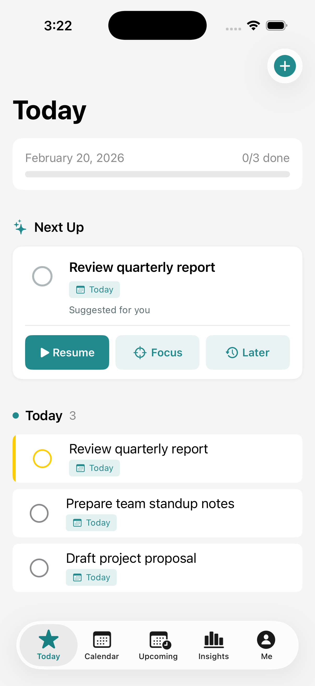
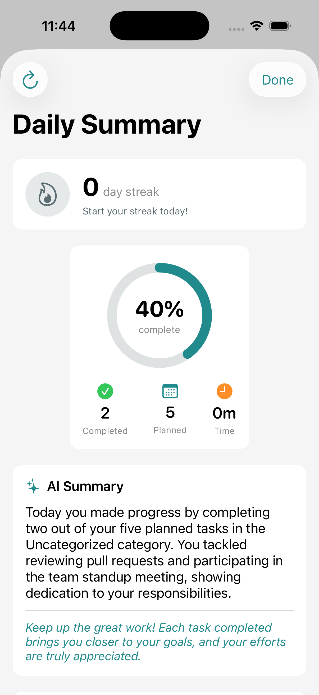
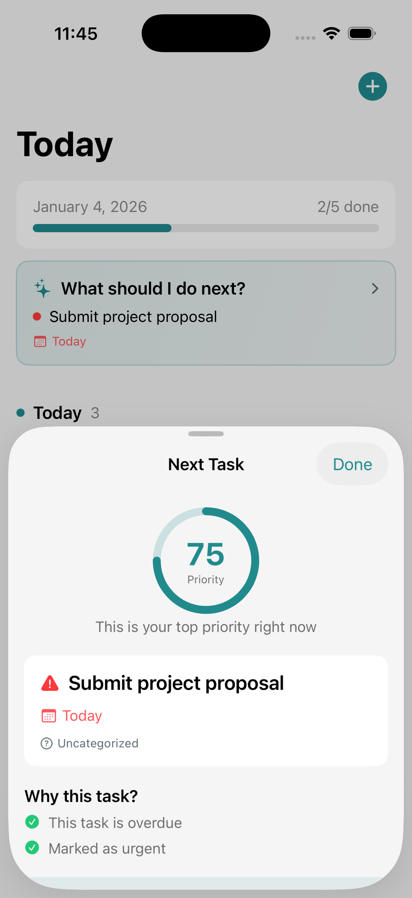

# Taskweave

[](https://github.com/connectwithprakash/taskweave/releases)
[](https://developer.apple.com/ios/)
[](LICENSE)
[](https://swift.org)

**An AI-powered task companion.** A free, open-source todo app for iOS that helps us stay focused on what matters most.

<p align="center">
  
  
  
  
</p>

## Why Taskweave?

Most todo apps just store tasks. Taskweave lets us **plan our day** by combining calendar with tasks. See when we're free, schedule tasks as time blocks, and let AI tell us what to work on next.

### Key Highlights

- **Plan Our Day** - View calendar events alongside tasks. Schedule tasks as time blocks during free time.
- **"What should I do next?"** - AI analyzes tasks and recommends the most important one with a priority score and reasoning
- **Daily Summary** - Track productivity stats, completion streaks, and get AI-generated insights
- **Morning Briefing** - Start the day with yesterday's recap and today's plan
- **Works Everywhere** - iPhone, iPad, Apple Watch, widgets, and Siri

## Features

### Smart Task Management
- Create tasks with due dates, priorities, reminders, and estimated durations
- Organize with custom lists (with icons and colors)
- Recurring tasks (daily, weekly, monthly, yearly)
- Priority levels: Urgent, High, Medium, Low
- Quick actions: swipe to complete, delete, or reschedule

### AI-Powered Intelligence
- **Priority Scoring**: Each task gets a 0-100 score based on urgency, importance, and due date
- **"Why this task?"**: AI explains why it's recommending a specific task
- **Daily Summary**: AI-generated recap of productivity with personalized insights
- **Multi-provider support**: Apple Intelligence, Anthropic Claude, or OpenAI

### Calendar Integration
- Native Apple Calendar integration via EventKit
- Day and week calendar views
- View events and tasks together
- Schedule tasks as time blocks

### Daily Productivity Features
- **Progress Tracking**: See "X of Y done" with visual progress bar
- **Day Streaks**: Build habits by completing tasks daily
- **Morning Briefing**: Start the day with yesterday's recap and today's priorities
- **Evening Summary**: Review accomplishments before bed

### Home Screen Widgets
- **Small**: Task count with completion progress ring
- **Medium**: Today's task list with priority indicators
- **Large**: Sections for overdue, today, and upcoming tasks

### Live Activities & Dynamic Island
- Lock Screen progress tracking
- Dynamic Island with current task and progress
- Auto-updates as tasks are completed

### Apple Watch
- Today's tasks on the wrist
- Tap to complete tasks
- Real-time sync with iPhone
- Watch complications

### iPad Optimization
- Sidebar navigation with NavigationSplitView
- Adaptive layouts for all screen sizes
- Keyboard shortcuts (Cmd+N, Cmd+F, Cmd+1-5)

### Siri Shortcuts
- "Add a task in Taskweave"
- "Complete my next task"
- "What's on my agenda"

## Views

| View | Purpose |
|------|---------|
| **Today** | Focus on what needs to be done now. Shows overdue tasks, today's tasks, and completed items with progress tracking. |
| **Calendar** | Day and week views with Apple Calendar events. Schedule tasks as time blocks. |
| **Upcoming** | Plan ahead. Tasks grouped by date (Tomorrow, This Week, Later). |
| **Lists** | Organize by project. Smart lists (Inbox, Today, Upcoming) plus custom lists with icons and colors. |
| **Settings** | Theme, notifications, Morning Briefing, Daily Summary, and AI provider configuration. |

## Technical Details

- **Offline-first**: Core Data with full offline support
- **Cloud sync**: iCloud via CloudKit
- **Native UI**: 100% SwiftUI
- **Accessibility**: VoiceOver support, Dynamic Type
- **Themes**: System, Light, and Dark modes

## Requirements

- iOS 17.0+
- Xcode 15.0+

## Getting Started

1. Clone the repository
   ```bash
   git clone https://github.com/connectwithprakash/taskweave.git
   ```
2. Open `Taskweave.xcodeproj` in Xcode
3. Build and run on simulator or device

## Deployment

Taskweave uses [Fastlane](https://fastlane.tools/) for automated deployments to TestFlight and the App Store.

```bash
# Install dependencies
bundle install

# Deploy to TestFlight
export MATCH_PASSWORD="your-password"
bundle exec fastlane beta

# Deploy to App Store
bundle exec fastlane release
```

See [deployment guide](docs/project/deployment.md) for full setup instructions.

## Contributing

See [CONTRIBUTING.md](CONTRIBUTING.md) for development workflow, commit conventions, and how to submit pull requests.

## Open Source Principles

Building software has never been more accessible. With AI-assisted development, the cost of creating quality apps has dropped dramatically. This means we can focus entirely on **making something genuinely useful** rather than figuring out how to monetize it.

Taskweave is built on these principles:

| Principle | What It Means |
|-----------|---------------|
| **Useful First** | Every feature exists to help you get things done. No dark patterns, no engagement hacks, no features designed to keep you in the app longer. |
| **Privacy First** | Your tasks stay on your device. No analytics, no tracking, no data collection. Only iCloud sync if you enable it. |
| **No Hidden Costs** | Completely free. No ads, no premium tiers, no subscriptions. Ever. |
| **Full Transparency** | Every line of code is visible. See exactly how AI features work and how your data is handled. |
| **Community Driven** | Open to contributions. Bug fixes, features, and ideas from anyone who wants to help. |
| **Built to Last** | Open source means the app lives on. Your productivity tool won't disappear if development slows. |

## License

[MIT](LICENSE)

---

Built with [Claude Code](https://claude.com/claude-code)
