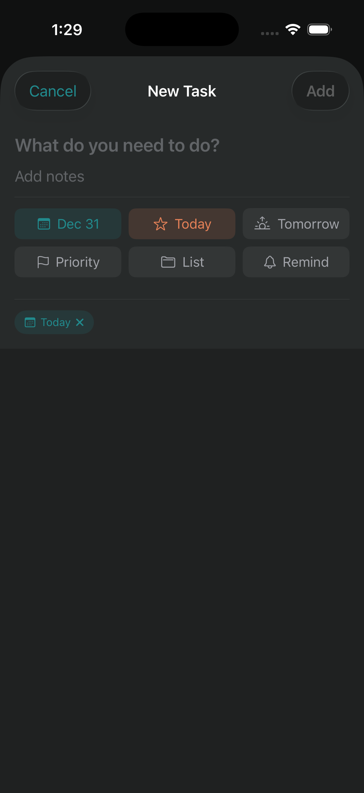
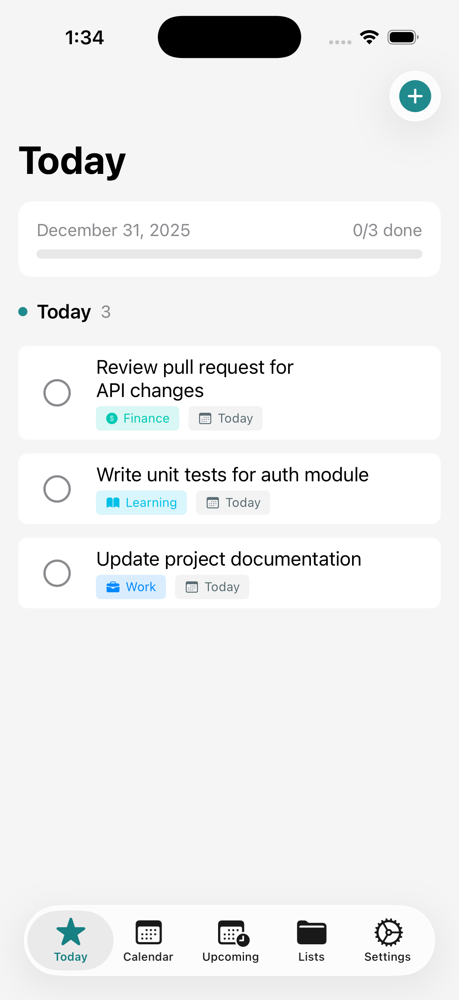
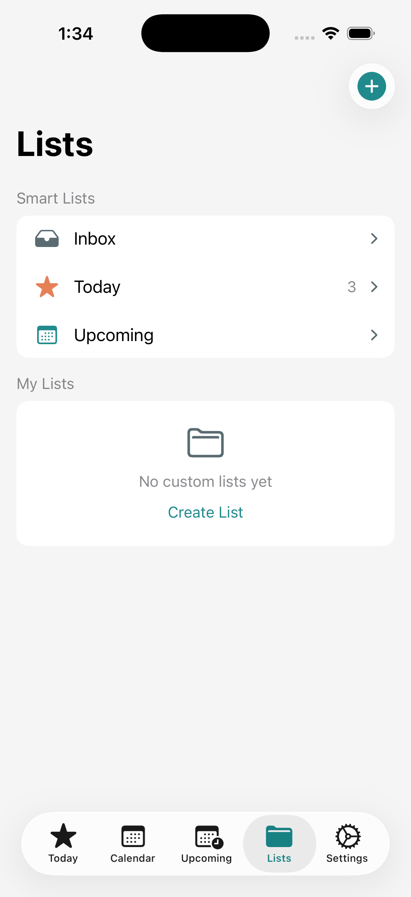
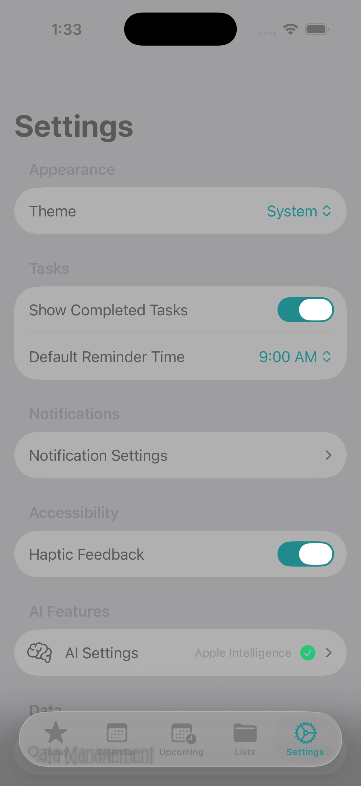

# Taskweave Design System

A comprehensive design system for building consistent, accessible, and beautiful interfaces.

> **Interactive Gallery**: View all screenshots and visual examples at [docs/design/](../design/) (when served via GitHub Pages).

## Visual Preview

### Dark Mode
| Today View | Add Task | Task List |
|------------|----------|-----------|
|  |  |  |

### Light Mode
| Today View | Lists | Settings |
|------------|-------|----------|
|  |  |  |

---

## Table of Contents

1. [Design Philosophy](#design-philosophy)
2. [Competitive Analysis](#competitive-analysis)
3. [Brand Identity](#brand-identity)
4. [Color System](#color-system)
5. [Typography](#typography)
6. [Spacing & Layout](#spacing--layout)
7. [Components](#components)
8. [Iconography](#iconography)
9. [Motion & Animation](#motion--animation)
10. [Accessibility](#accessibility)
11. [Dark Mode](#dark-mode)
12. [Implementation](#implementation)

---

## Design Philosophy

### Core Principles

| Principle | Description | Implementation |
|-----------|-------------|----------------|
| **Clarity** | Information hierarchy guides attention | Large titles, clear sections, visual weight |
| **Efficiency** | Minimize taps to complete common tasks | Quick actions, smart defaults, gestures |
| **Deference** | Content over chrome | Minimal UI, content-first layouts |
| **Depth** | Visual layers create hierarchy | Subtle elevation, blur effects, overlays |

### Design Rationale

**Why Calendar-First?**
Engineers schedule their days around meetings. A task app that ignores calendar context fails to address the core problem: finding *when* to do tasks, not just *what* to do. Taskweave puts the calendar at the center, making time-blocking a first-class feature.

**Why Minimal UI?**
Productivity apps should disappear into the background. Every visual element competes for cognitive attention. We chose a restrained palette and simple forms to keep focus on tasks, not the app itself.

**Why Teal?**
- Differentiates from competitors (Todoist red, Things blue, Apple Reminders orange)
- Calming yet energizing - appropriate for productivity
- High contrast ratio against both light and dark backgrounds
- Associated with focus, clarity, and balance

---

## Competitive Analysis

### Visual Design Comparison

| App | Primary Color | Background | Typography | Density |
|-----|---------------|------------|------------|---------|
| **Taskweave** | Teal #218A8D | Light gray/Dark | SF Pro | Medium |
| Todoist | Red #DB4035 | White/Dark | System | High |
| Things 3 | Blue #4A90D9 | White/Dark | Helvetica Neue | Low |
| TickTick | Blue #4772FA | White/Dark | System | High |
| Apple Reminders | Orange/Multi | White/Dark | SF Pro | Medium |
| Fantastical | Red #F44336 | White/Dark | SF Pro | Medium |

### Key Differentiators

**vs. Todoist**
- Todoist: Dense, information-heavy, karma gamification
- Taskweave: Clean, calendar-integrated, professional focus

**vs. Things 3**
- Things: Beautiful but no calendar view, one-time purchase
- Taskweave: Calendar-first, free and open source

**vs. Apple Reminders**
- Reminders: Simple but limited calendar integration
- Taskweave: Deep calendar integration, AI estimation

**vs. Fantastical**
- Fantastical: Calendar-first but complex UI, subscription
- Taskweave: Simpler task focus, free, engineer-targeted

### Lessons Learned from Competitors

1. **Things 3**: Whitespace matters - don't fear empty space
2. **Todoist**: Progressive disclosure - show advanced features when needed
3. **Apple Reminders**: Native feel matters - follow HIG closely
4. **Fantastical**: Calendar + tasks can coexist beautifully

---

## Brand Identity

### Core Values

| Value | Expression |
|-------|------------|
| **Simplicity** | Clean interfaces, minimal chrome, focused features |
| **Focus** | One primary action per screen, clear hierarchy |
| **Trust** | Reliable sync, consistent behavior, no dark patterns |
| **Accessibility** | Universal design, not an afterthought |

### Voice & Tone

- Clear and concise, never verbose
- Helpful without being patronizing
- Professional yet approachable
- Uses "you" not "user"

### Naming Conventions

- **App name**: Taskweave (one word, capital T)
- **Tagline**: "Calendar-first task management"
- **Feature names**: Descriptive, not clever (e.g., "Smart Reschedule" not "TimeMagic")

---

## Color System

### Primary Palette

| Role | Light Mode | Dark Mode | Usage |
|------|------------|-----------|-------|
| **Accent** | `#218A8D` | `#2BA5A8` | Primary actions, active states, links |
| **Accent Hover** | `#2BA5A8` | `#35BFC2` | Hover/focus states |
| **Accent Pressed** | `#1A6E70` | `#218A8D` | Active/pressed states |

### Semantic Colors

| Role | Light Mode | Dark Mode | Usage |
|------|------------|-----------|-------|
| **Success** | `#34C759` | `#30D158` | Completed tasks, confirmations |
| **Warning** | `#FF9500` | `#FFD60A` | Due soon, warnings |
| **Error** | `#FF3B30` | `#FF453A` | Errors, overdue tasks |
| **Info** | `#007AFF` | `#0A84FF` | Information, links |

### Surface Colors

| Level | Light Mode | Dark Mode | Usage |
|-------|------------|-----------|-------|
| **Background** | `#FFFFFF` | `#1F2121` | Main canvas |
| **Surface** | `#F5F5F5` | `#2C2C2E` | Cards, grouped content |
| **Surface Elevated** | `#E5E5EA` | `#3A3A3C` | Elevated elements, dividers |
| **Surface Overlay** | `#D1D1D6` | `#48484A` | Overlays, dropdowns |

### Text Colors

| Role | Light Mode | Dark Mode | Usage |
|------|------------|-----------|-------|
| **Primary** | `#000000` | `#FFFFFF` | Headings, body text |
| **Secondary** | `#3C3C43` @ 60% | `#EBEBF5` @ 60% | Subtitles, descriptions |
| **Tertiary** | `#3C3C43` @ 30% | `#EBEBF5` @ 30% | Placeholders, hints |
| **Disabled** | `#3C3C43` @ 20% | `#EBEBF5` @ 20% | Disabled text |

### Color Accessibility

All color combinations meet WCAG 2.1 AA standards (4.5:1 for normal text, 3:1 for large text):

| Combination | Ratio | Rating |
|-------------|-------|--------|
| Accent on Background | 4.5:1 | AA |
| Primary Text on Background | 21:1 | AAA |
| Secondary Text on Background | 7:1 | AAA |
| Error on Background | 4.6:1 | AA |

---

## Typography

### Type Scale

Based on Apple's Human Interface Guidelines, using SF Pro (San Francisco):

| Style | Size | Weight | Line Height | Letter Spacing | Usage |
|-------|------|--------|-------------|----------------|-------|
| **Large Title** | 34pt | Bold | 41pt | 0.37pt | Screen titles |
| **Title 1** | 28pt | Bold | 34pt | 0.36pt | Section headers |
| **Title 2** | 22pt | Bold | 28pt | 0.35pt | Card titles |
| **Title 3** | 20pt | Semibold | 25pt | 0.38pt | Subsections |
| **Headline** | 17pt | Semibold | 22pt | -0.41pt | List item titles |
| **Body** | 17pt | Regular | 22pt | -0.41pt | Primary content |
| **Callout** | 16pt | Regular | 21pt | -0.32pt | Secondary content |
| **Subheadline** | 15pt | Regular | 20pt | -0.24pt | Supporting text |
| **Footnote** | 13pt | Regular | 18pt | -0.08pt | Captions, metadata |
| **Caption 1** | 12pt | Regular | 16pt | 0pt | Labels |
| **Caption 2** | 11pt | Regular | 13pt | 0.06pt | Timestamps |

### Font Families

| Family | Usage |
|--------|-------|
| **SF Pro Text** | Sizes < 20pt |
| **SF Pro Display** | Sizes >= 20pt |
| **SF Mono** | Code, time displays, numbers in tables |

### Typography Guidelines

1. **Hierarchy**: Use no more than 3 type sizes per screen
2. **Contrast**: Primary text should have 4.5:1 minimum contrast
3. **Line Length**: 50-75 characters per line for readability
4. **Alignment**: Left-align body text, center sparingly for emphasis

---

## Spacing & Layout

### Base Unit

All spacing derives from a 4pt base unit for visual harmony:

| Token | Value | Usage |
|-------|-------|-------|
| `space-xxs` | 2pt | Tight inline spacing |
| `space-xs` | 4pt | Icon-text gaps |
| `space-sm` | 8pt | Related element spacing |
| `space-md` | 12pt | Component internal padding |
| `space-lg` | 16pt | Section spacing |
| `space-xl` | 24pt | Card padding |
| `space-xxl` | 32pt | Screen margins |
| `space-3xl` | 48pt | Major section breaks |

### Layout Grid

| Property | Compact (iPhone SE) | Regular (iPhone 15) | Large (iPad) |
|----------|---------------------|---------------------|--------------|
| Screen Margin | 16pt | 20pt | 40pt |
| Card Padding | 12pt | 16pt | 24pt |
| Gutter | 8pt | 12pt | 16pt |
| Max Content Width | 100% | 100% | 680pt |

### Touch Targets

Per Apple HIG and WCAG guidelines:

| Element | Minimum Size | Recommended Size |
|---------|--------------|------------------|
| Buttons | 44pt x 44pt | 50pt x 44pt |
| Icons | 44pt x 44pt | 44pt x 44pt |
| List Rows | 44pt height | 60pt height |
| Checkboxes | 44pt x 44pt | 44pt x 44pt |

---

## Components

### Buttons

#### Primary Button
```
+-----------------------------+
|       Button Label          |  Height: 50pt
+-----------------------------+  Radius: 12pt
                                  Padding: 16pt horizontal
Background: Accent (#218A8D)
Text: White, Body Semibold
```

#### Secondary Button
```
+-----------------------------+
|       Button Label          |  Height: 50pt
+-----------------------------+  Radius: 12pt

Background: Surface (#F5F5F5)
Text: Accent, Body Semibold
```

#### Destructive Button
```
+-----------------------------+
|         Delete              |  Height: 50pt
+-----------------------------+  Radius: 12pt

Background: Error (#FF3B30)
Text: White, Body Semibold
```

### Cards

```
+---------------------------------+
|                                 |
|  Card Title                     |  Padding: 16pt
|  Supporting text goes here      |  Radius: 16pt
|                                 |  Background: Surface
|  [ Action ]                     |
|                                 |
+---------------------------------+
```

### List Items

```
+-----------------------------------------------------+
| O  Task Title                              Today >  |  Height: 60pt min
|    Description text here...                         |  Padding: 16pt horiz
|-----------------------------------------------------|  Divider: 1pt, inset 56pt
| *  Completed Task                      Yesterday    |
|    ---------------                                  |
+-----------------------------------------------------+
```

### Checkboxes

| State | Visual | Size |
|-------|--------|------|
| Unchecked | O (2pt border, tertiary) | 24pt x 24pt |
| Checked | * (filled accent, white checkmark) | 24pt x 24pt |
| Disabled | O (1pt border, disabled) | 24pt x 24pt |

Corner radius: 6pt (rounded square)

### Text Fields

```
+---------------------------------+
| Placeholder text                |  Height: 44pt
+---------------------------------+  Radius: 10pt
                                     Padding: 12pt horizontal
Background: Surface Elevated (#E5E5EA)
Text: Primary
Placeholder: Tertiary
```

### Floating Action Button (FAB)

```
      +-----+
      |  +  |    Size: 56pt x 56pt
      +-----+    Radius: 28pt (circle)
                 Shadow: 0 4pt 12pt rgba(0,0,0,0.15)
Background: Accent (#218A8D)
Icon: White, 24pt
Position: Bottom-right, 24pt from edges
```

---

## Calendar View Components (v0.2.0)

### View Mode Picker

```
+-----------------------------+
|    [ Day ]  [ Week ]        |  Segmented control
+-----------------------------+  Position: Top, below nav bar
                                  Padding: 16pt horizontal, 8pt vertical
```

### Date Navigation Bar

```
+-------------------------------------+
|  <     December 29 - January 4    > |  Height: 44pt
+-------------------------------------+  Padding: 16pt horizontal
                                         Arrows: 44pt touch target
                                         Date: Headline weight
```

### Day View (Hour Grid)

```
+-----------------------------------------+
| 9 AM |----------------------------------|
|      |  [Meeting Block]                 |  Hour height: 60pt
| 10 AM|----------------------------------| Start hour: 6 AM
|      |        |                         |  End hour: 10 PM
| 11 AM|----------------------------------| Time label width: 50pt
|      |  [Task Time Block]               |
| 12 PM|----------------------------------|
|      |                                  |
+-----------------------------------------+
```

### Event Block

```
+--------------------------------+
| Meeting Title                  |  Height: Calculated from duration
| 10:00 AM - 11:00 AM            |  Min height: 20pt
+--------------------------------+  Radius: 6pt
                                    Background: Calendar color @ 80%
                                    Text: White, Caption 1
                                    Padding: 8pt horizontal, 4pt vertical
```

### Week View (Day Columns)

```
+--+--+--+--+--+--+--+
|SU|MO|TU|WE|TH|FR|SA|  Day headers
|29|30|31| 1| 2| 3| 4|
+--+--+--+--+--+--+--+
|  |  |  |  |  |  |  |
|* |* |  |* |  |* |  |  Compact event dots
|* |  |  |  |  |  |  |
|  |  |  |  |  |  |  |  Column min height: 150pt
+--+--+--+--+--+--+--+
```

### Time Block Sheet

```
+------------------------------------+
|  Schedule Time Block        Cancel |
|------------------------------------|
|  [Task Info Section]               |
|    Task Title                      |
|    Task description...             |
|------------------------------------|
|  [Schedule Section]                |
|    Start Time:    Dec 31, 9:00 AM  |
|    Duration:      [1 hour v]       |
|    End Time:      10:00 AM         |
|------------------------------------|
|           [ Create ]               |
+------------------------------------+

Presentation: Sheet, medium/large detents
Duration options: 15min, 30min, 45min, 1hr, 1.5hr, 2hr, 3hr, 4hr
```

### Calendar Access Banner

```
+---------------------------------------------+
| [!] Calendar access needed     [ Enable ]   |
+---------------------------------------------+

Background: Orange @ 10%
Icon: calendar.badge.exclamationmark, Orange
Text: Subheadline
Button: Subheadline, Semibold
Position: Below view mode picker
```

---

## AI Components (v0.3.0)

### Category Badge

```
+------------------+
| [icon] Category  |  Auto-detected task category
+------------------+  Background: Category color @ 15%
                      Text: Category color
                      Icon: Category-specific SF Symbol
                      Radius: small
```

**Category Colors**:
| Category | Color | Icon |
|----------|-------|------|
| Work | Blue | briefcase.fill |
| Personal | Purple | person.fill |
| Health | Green | heart.fill |
| Finance | Mint | dollarsign.circle.fill |
| Shopping | Orange | cart.fill |
| Errands | Yellow | figure.walk |
| Learning | Cyan | book.fill |
| Home | Brown | house.fill |

### AI Suggestions Card

```
+------------------------------------+
| [sparkles] AI Suggestions          |
|------------------------------------|
|  Suggested Priority: High          |
|  Estimated Duration: 30 min        |
|  Best Time: Morning                |
|  Category: Work                    |
|------------------------------------|
|  [ Apply ]  [ Dismiss ]            |
+------------------------------------+

Background: Surface
Border: 1pt, Accent @ 30%
Radius: medium
Icon: sparkles, Accent color
```

### LLM Provider Picker

```
+------------------------------------+
|  AI Provider                       |
|------------------------------------|
|  (*) Apple Intelligence            |  Free, on-device
|  ( ) Anthropic Claude              |  API key required
|  ( ) OpenAI GPT                    |  API key required
+------------------------------------+

Style: List with radio selection
Subtitle: Provider description
```

---

## Widget Components (v0.6.0)

### Design Principles

| Principle | Implementation |
|-----------|----------------|
| **Glanceable** | Key info visible in < 2 seconds |
| **Consistent** | Uses app's teal accent and design tokens |
| **Adaptive** | Works in light/dark mode |
| **Focused** | Shows only actionable tasks |

### Widget Sizes

| Size | Dimensions | Content |
|------|------------|---------|
| Small | 2x2 | Task count + progress ring |
| Medium | 4x2 | Today's task list (4 items) |
| Large | 4x4 | Sectioned view with cards |

### Small Widget

```
+-------------------+
| [*] Taskweave     |
|                   |
|    +------+       |   Progress ring: 6pt stroke
|    |  3   |       |   Teal accent color
|    | tasks|       |   Center: count + label
|    +------+       |
|                   |
|   [*] 2/5         |   Footer: completed count
+-------------------+
```

### Medium Widget

```
+---------------------------------------+
| Today                           (O)   |  Header: title + progress ring
| 2 overdue                             |  Overdue badge (red, if any)
|---------------------------------------|
| |  O  Review project            [*]   |  Priority bar (3pt, left edge)
| |  O  Team meeting              [*]   |  Checkbox circle (16pt)
| |  O  Send report               [ ]   |  Task title
| +2 more                               |  Remaining count
+---------------------------------------+
```

### Large Widget

```
+---------------------------------------+
| [*] Taskweave                   2/5 O |  Header with app name
|---------------------------------------|
| [!] Overdue (2)                       |  Section header (red)
| +-----------------------------------+ |
| | *  O  Submit report               | |  Card background
| |----O  Pay bills                   | |  Dividers between tasks
| +-----------------------------------+ |
|                                       |
| [=] Today (3)                         |  Section header (teal)
| +-----------------------------------+ |
| | *  O  Team meeting                | |
| |----O  Code review                 | |
| | +1 more                           | |
| +-----------------------------------+ |
+---------------------------------------+
```

### Widget Colors

| Element | Color | Usage |
|---------|-------|-------|
| Accent | `#218A8D` | Progress rings, Today header |
| Urgent | `#E53935` | Overdue section, urgent priority |
| High | `#F58424` | High priority indicator |
| Medium | `#F6C032` | Medium priority indicator |
| Low | `#417ADE` | Low priority indicator |
| Card BG | `secondarySystemBackground` | Task list cards |

### Priority Indicators

| Priority | Visual | Color |
|----------|--------|-------|
| Urgent | Filled circle (8pt) | Red `#E53935` |
| High | Filled circle (8pt) | Orange `#F58424` |
| Medium | Filled circle (8pt) | Yellow `#F6C032` |
| Low | Filled circle (8pt) | Blue `#417ADE` |
| None | Filled circle (8pt) | Gray 40% opacity |

### Empty State

```
+-------------------+
|                   |
|    [sparkles]     |   Icon: sparkles, teal
|    All clear!     |   Title: semibold
|  No tasks today   |   Subtitle: secondary
|                   |
+-------------------+
```

### Technical Notes

- **No ScrollView**: Widgets don't support scrolling
- **Data sharing**: UserDefaults via App Groups
- **Refresh**: Every 15 minutes + on task change
- **Background**: `containerBackground` API for iOS 17+

---

## Iconography

### Icon Style

- **Source**: SF Symbols (Apple's system icons)
- **Weight**: Regular (matches body text weight)
- **Rendering**: Template (uses foreground color)

### Icon Sizes

| Context | Size | Example |
|---------|------|---------|
| Inline with text | 17pt | Task priority indicator |
| Standalone button | 24pt | Navigation icons |
| Empty state | 64pt | No tasks illustration |
| Tab bar | 24pt | Navigation tabs |

### Common Icons

| Action | SF Symbol | Filled Variant |
|--------|-----------|----------------|
| Add | `plus` | `plus.circle.fill` |
| Complete | `checkmark` | `checkmark.circle.fill` |
| Delete | `trash` | `trash.fill` |
| Edit | `pencil` | `pencil.circle.fill` |
| Calendar | `calendar` | `calendar.circle.fill` |
| List | `list.bullet` | - |
| Settings | `gear` | `gearshape.fill` |
| Search | `magnifyingglass` | - |
| High Priority | `exclamationmark` | `exclamationmark.circle.fill` |
| Reminder | `bell` | `bell.fill` |
| Recurring | `repeat` | `repeat.circle.fill` |
| Time | `clock` | `clock.fill` |
| AI/Smart | `sparkles` | `sparkles.fill` (v0.3.0+) |

---

## Motion & Animation

### Duration Scale

| Type | Duration | Easing | Usage |
|------|----------|--------|-------|
| **Instant** | 0ms | - | State changes without animation |
| **Fast** | 150ms | ease-out | Micro-interactions, toggles |
| **Normal** | 250ms | ease-in-out | Page transitions, modals |
| **Slow** | 400ms | ease-in-out | Complex animations, onboarding |

### SwiftUI Animation Presets

```swift
// Quick feedback
.animation(.easeOut(duration: 0.15), value: isToggled)

// Standard transitions
.animation(.easeInOut(duration: 0.25), value: isPresented)

// Playful interactions (task completion)
.animation(.spring(response: 0.3, dampingFraction: 0.6), value: isCompleted)

// Smooth scrolling
.animation(.interactiveSpring(), value: scrollOffset)
```

### Haptic Feedback

| Event | Haptic Type | SwiftUI |
|-------|-------------|---------|
| Task complete | Success | `UINotificationFeedbackGenerator().notificationOccurred(.success)` |
| Task delete | Warning | `UINotificationFeedbackGenerator().notificationOccurred(.warning)` |
| Error | Error | `UINotificationFeedbackGenerator().notificationOccurred(.error)` |
| Selection | Light | `UIImpactFeedbackGenerator(style: .light).impactOccurred()` |
| Drag | Medium | `UIImpactFeedbackGenerator(style: .medium).impactOccurred()` |

### Reduce Motion

Always respect user accessibility settings:

```swift
@Environment(\.accessibilityReduceMotion) var reduceMotion

.animation(reduceMotion ? .none : .spring(), value: animatedValue)
```

---

## Accessibility

### WCAG 2.1 Compliance

| Level | Target | Status |
|-------|--------|--------|
| A | Required | Compliant |
| AA | Required | Compliant |
| AAA | Stretch goal | Partial |

### Contrast Ratios

All text meets minimum 4.5:1 contrast (7:1 preferred):

| Element | Ratio | Level |
|---------|-------|-------|
| Body text | 21:1 (black on white) | AAA |
| Secondary text | 7:1 | AAA |
| Accent text | 4.5:1 | AA |
| Disabled text | 3:1 | Informational |

### VoiceOver Support

All interactive elements include:

1. **Accessibility Label**: Clear, concise description
2. **Accessibility Hint**: Action result (optional)
3. **Accessibility Traits**: Button, selected, etc.
4. **Custom Actions**: Swipe actions exposed

Example:
```swift
Button("Complete") { ... }
    .accessibilityLabel("Mark task complete")
    .accessibilityHint("Double tap to complete \(taskTitle)")
    .accessibilityAddTraits(.isButton)
```

### Dynamic Type

All text scales with system font size settings:

| Category | Minimum | Default | Maximum |
|----------|---------|---------|---------|
| xSmall | 14pt | - | - |
| Small | 15pt | - | - |
| Medium | 16pt | - | - |
| Large | - | 17pt | - |
| xLarge | - | - | 19pt |
| xxLarge | - | - | 21pt |
| xxxLarge | - | - | 23pt |
| AX1-AX5 | - | - | 28-53pt |

### Focus Management

1. After adding task: Focus returns to FAB
2. After completing task: Focus moves to next task
3. After error: Focus moves to error message
4. Modal dismiss: Focus returns to trigger element

---

## Dark Mode

### Design Principles

1. **True black** base for OLED efficiency (#1F2121)
2. **Elevated surfaces** use lighter grays (not shadows)
3. **Accent colors** remain vibrant (slightly lighter)
4. **Reduced brightness** for comfortable night reading

### Elevation Hierarchy

In dark mode, elevation is expressed through lighter backgrounds:

| Level | Color | Usage |
|-------|-------|-------|
| Base | `#1F2121` | Main background |
| Level 1 | `#2C2C2E` | Cards, sheets |
| Level 2 | `#3A3A3C` | Elevated cards, popovers |
| Level 3 | `#48484A` | Highest elevation |

### Color Adjustments

| Element | Light to Dark |
|---------|---------------|
| Accent | `#218A8D` to `#2BA5A8` (10% lighter) |
| Success | `#34C759` to `#30D158` (system green) |
| Warning | `#FF9500` to `#FFD60A` (brighter yellow) |
| Error | `#FF3B30` to `#FF453A` (system red) |

### Implementation

```swift
// Color asset with automatic adaptation
Color("AccentColor") // Defined in Assets.xcassets

// Programmatic adaptation
@Environment(\.colorScheme) var colorScheme
let accentColor = colorScheme == .dark ? Color(hex: "#2BA5A8") : Color(hex: "#218A8D")
```

---

## Implementation

### Design Tokens in SwiftUI

All design values are centralized in `DesignSystem.swift`:

```swift
import SwiftUI

enum DesignSystem {

    // MARK: - Colors
    enum Colors {
        static let accent = Color("AccentColor")
        static let success = Color.green
        static let warning = Color.orange
        static let error = Color.red

        static let backgroundPrimary = Color("BackgroundPrimary")
        static let backgroundSecondary = Color("BackgroundSecondary")

        static let textPrimary = Color("TextPrimary")
        static let textSecondary = Color("TextSecondary")
        static let textTertiary = Color("TextTertiary")
    }

    // MARK: - Typography
    enum Typography {
        static let largeTitle = Font.largeTitle.bold()
        static let title1 = Font.title.bold()
        static let title2 = Font.title2.bold()
        static let title3 = Font.title3.weight(.semibold)
        static let headline = Font.headline
        static let body = Font.body
        static let callout = Font.callout
        static let subheadline = Font.subheadline
        static let footnote = Font.footnote
        static let caption1 = Font.caption
        static let caption2 = Font.caption2
    }

    // MARK: - Spacing
    enum Spacing {
        static let xxs: CGFloat = 2
        static let xs: CGFloat = 4
        static let sm: CGFloat = 8
        static let md: CGFloat = 12
        static let lg: CGFloat = 16
        static let xl: CGFloat = 24
        static let xxl: CGFloat = 32
        static let xxxl: CGFloat = 48
    }

    // MARK: - Corner Radius
    enum CornerRadius {
        static let small: CGFloat = 6
        static let medium: CGFloat = 10
        static let large: CGFloat = 12
        static let xlarge: CGFloat = 16
        static let round: CGFloat = 9999
    }

    // MARK: - Animation
    enum Animation {
        static let fast = SwiftUI.Animation.easeOut(duration: 0.15)
        static let normal = SwiftUI.Animation.easeInOut(duration: 0.25)
        static let slow = SwiftUI.Animation.easeInOut(duration: 0.40)
        static let spring = SwiftUI.Animation.spring(response: 0.3, dampingFraction: 0.6)
    }
}
```

### Color Assets

Define colors in `Assets.xcassets` with light/dark variants:

```
Assets.xcassets/
  AccentColor.colorset/
    Contents.json (light: #218A8D, dark: #2BA5A8)
  BackgroundPrimary.colorset/
    Contents.json (light: #FFFFFF, dark: #1F2121)
  BackgroundSecondary.colorset/
    Contents.json (light: #F5F5F5, dark: #2C2C2E)
  TextPrimary.colorset/
    Contents.json (light: #000000, dark: #FFFFFF)
  TextSecondary.colorset/
    Contents.json (light: #3C3C43/60%, dark: #EBEBF5/60%)
  TextTertiary.colorset/
    Contents.json (light: #3C3C43/30%, dark: #EBEBF5/30%)
```

### Usage Examples

```swift
// Button with design system
Button("Add Task") {
    // action
}
.font(DesignSystem.Typography.body.weight(.semibold))
.foregroundColor(.white)
.padding(.horizontal, DesignSystem.Spacing.lg)
.padding(.vertical, DesignSystem.Spacing.md)
.background(DesignSystem.Colors.accent)
.cornerRadius(DesignSystem.CornerRadius.large)

// Card with design system
VStack(alignment: .leading, spacing: DesignSystem.Spacing.sm) {
    Text("Task Title")
        .font(DesignSystem.Typography.headline)
        .foregroundColor(DesignSystem.Colors.textPrimary)

    Text("Due tomorrow")
        .font(DesignSystem.Typography.subheadline)
        .foregroundColor(DesignSystem.Colors.textSecondary)
}
.padding(DesignSystem.Spacing.lg)
.background(DesignSystem.Colors.backgroundSecondary)
.cornerRadius(DesignSystem.CornerRadius.xlarge)
```

---

## Version History

| Version | Changes |
|---------|---------|
| v0.1.0 | Initial design system |
| v0.2.0 | Calendar view components |
| v0.3.0 | AI feature styling |
| v0.4.0 | Smart reschedule UI, conflict banners |
| v0.5.0 | Siri Shortcuts integration |
| v0.6.0 | Home Screen Widget components |
